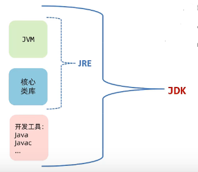
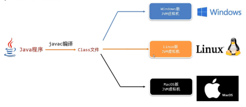
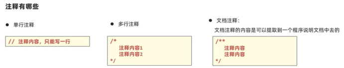
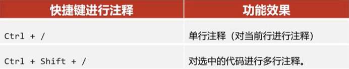
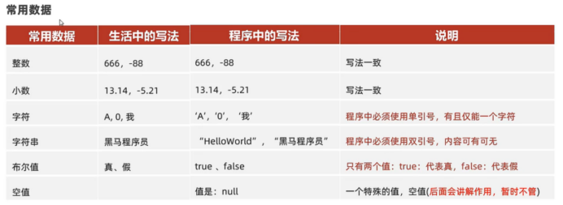
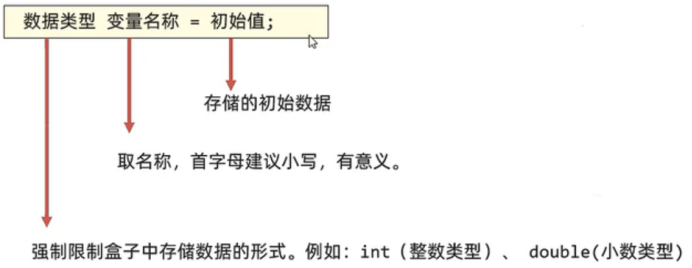
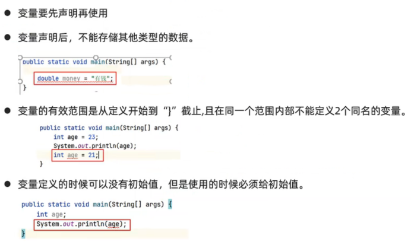

# 本篇为Java学习详细章节

## 第一章：Java快速入门

### 第一节：JDK的组成

- JVM（Java Virtual Machine）：Java虚拟机，真正运行Java程序的地方。
- 核心类库：Java自己写好的程序，给程序员自己的程序调用的。
- JRE（Java Runtime Environment）：Java的运行环境。
- JDK（Java Development Kit）：Java开发工具包（包括上面所有）。

### 第二节：Java的跨平台、工作原理
- Java一次编译，处处可用
- 我们的程序只需要开发一次，就可以在各种安装了JVM的系统平台上运行。
- 但运行必须装jvm 且版本要更高
- Java对标c++确实可以  c++在什么系统下编的就只能在什么系统用
- python和js  不用编译 到处运行
- go 交叉编译 脱离环境运行

### 第三节：Path与JAVA_HOME环境变量
- Path环境变量用于记住程序路径，方便在命令窗口的任意目录启动程序。
- JAVA_HOME：告诉操作系统JDK安装在了哪个位置（将来其他技术要通过这个环境变量找JDK）

## 第二章：Java基础语法

### 第一节：注释

``一定要养成写注释的好习惯！``

### 第二节：字面量与变量
- 计算机是用来处理数据的，**字面量**就是告诉程序员：**数据在程序中的书写格式**。

- 变量就是用来存储一个数据的内存区域（可以理解为盒子）且里面存储的数据可以变化。
- 变量定义的格式:

**变量使用注意事项**

